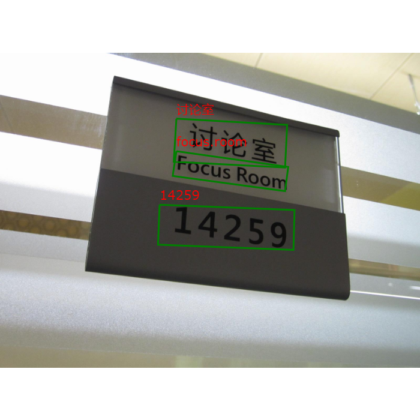

 scene-text-recog
=================================== 
Scene character recognition combining of CTPN + CRNN.

code based on [bear63/sceneReco commit-ae1731e](https://github.com/bear63/sceneReco/commit/ae1731e4a344359e1ff5a147ec8d3834afb16ba1)

# CTPN:

   Caffe model in [frcnn](https://github.com/makefile/frcnn/tree/fpn/src/caffe/CTPN), adapt from [tianzhi0549/CTPN](https://github.com/tianzhi0549/CTPN) of old Caffe.
	
# CRNN:

   Thsi repo uses Convolutional recurrent network in PyTorch: [meijieru/crnn.pytorch](https://github.com/meijieru/crnn.pytorch), while the original implementation [bgshih/crnn](https://github.com/bgshih/crnn) uses Torch.

# trained models:

  1. pure English set `alphabet` to English in `crnn.pytorch/keys.py`.
  [crnn.pth](https://www.dropbox.com/s/dboqjk20qjkpta3/crnn.pth?dl=0)
  2. Chinese with English recognition : [netCRNN63.pth](https://drive.google.com/open?id=1R1tvM_HVo5eJLqnTDpxFgMANPRk4_QHB) for GPU, [netCRNNcpu.pth](https://drive.google.com/open?id=1p8yWQ3j3hHiRA9pBYmge542Y1xetcg1x) for CPU.
  
  copy [ctpn_trained_model.caffemodel](https://drive.google.com/open?id=0B7c5Ix-XO7hqQWtKQ0lxTko4ZGs) to ./models/CTPN
  
  copy CRNN model to ./models
  
  CTPN models are tested on Caffe 1.0 CUDA8.0, CRNN models are tested on PyTorch '0.4.0' and '0.3.1'.

# Run demo

  python demo.py
  

